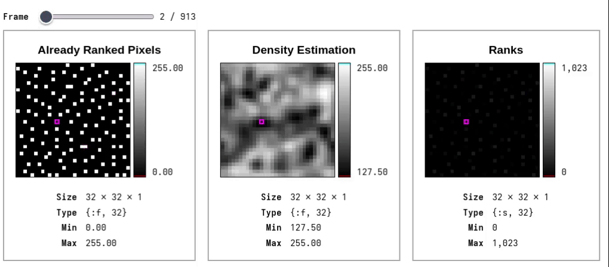
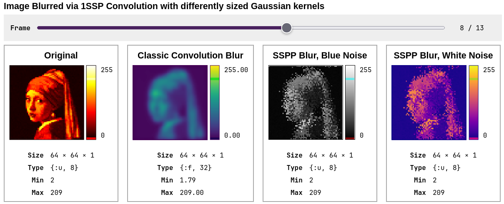

# KinoZoetrope



KinoZoetrope is a helper module for rendering 3D and 4D `Nx.Tensor`s as sequence of images or single image in [Livebook](https://livebook.dev/).

## Installation


In Livebook add `kino_zoetrope` to your dependencies:

```elixir
Mix.install([
  {:nx, "~> 0.10.0"},
  {:kino, "~> 0.18.0"},
  {:image, "~> 0.62.1"},
  # add this:
  {:kino_zoetrope, "~> 0.10.0"}
])
```

## Example

Inside Livebook a list of `Nx.Tensors` can be rendered like this:

```elixir
example_images = [
# Image 1 (16 frames, height: 16, width: 16)
Nx.iota({16,16,16}, axis: 2)
  |> Nx.add(12)
  |> Nx.add(Nx.iota({16,16,16}, axis: 0))
  |> Nx.add(Nx.iota({16,16,16}, axis: 1)),


# Image 2 (32 frames, height: 5, width: 13)
Nx.iota({32, 5, 13, 1}, axis: 2, type: :f32)
  |> Nx.divide(12)
  |> Nx.subtract(0.5)
  |> Nx.multiply(
    Nx.iota({32,5,13, 1}, axis: 0, type: :f32)
    |> Nx.divide(16)
    |> Nx.multiply(2)
  )
  |> Nx.multiply(Nx.Constants.pi())
  |> Nx.multiply(2)
  |> Nx.cos()
  |> Nx.multiply(16)
  |> Nx.add(32),


# Image 3 (1 frame, height: 5, width: 12)
Nx.iota({1, 5, 12}, axis: 2, type: :f32)
  |> Nx.multiply(3)
]

example_images
|> KinoZoetrope.TensorStack.new(
  # titel for all 3 images
  titel: "Example Gradients",
  # label for each individual image
  labels: ["Square", "Wave", "Gradient"],
  # intensitiy value to render as black, by default  the maximum of each image
  vmin: 0,
  # intensitiy value to render as white, by default the minimum of each image
  vmax: 64,
  # show meta info for each image
  show_meta: true,
  # rescale pixels values into 0-255 range
  normalize: true,
  # by default the first axis is expected to contain a stack of multiple images
  # to render only a single Tensor of shape {h,w}, this can be set to false
  multiple: true,
  # optionally specify a color map for all images:
  # cmap: "viridis",
  # or for each image invidually:
  # cmaps: ["viridis", nil, "plasma"]
  # add svg <rect> markers as overlay
  markers: [
    %{
      attrs: %{
        # SVG attributes
        "stroke" =>  "magenta",
        "stroke-width" => 2,
        "fill" => "none",
        "rx" => 10,
        "ry" => 10,
      },
      # indices of the images to add the markers to, here the first (0) and second (1) image
      for: [0,1],
      # list of {x,y} coordinates. The length if the list
      # should match the number of frames of the image
      points: [{3,3},{4,5},{6,9},{3,3},{4,5},{6,9},{3,3},{4,5},{6,9},{3,3},{4,5},{6,9}]
    },
  ]
)
```


### Color Maps



For grayscale images a color map can be specified. All the the [Matplotlib](https://matplotlib.org/stable/gallery/color/colormap_reference.html) color maps are supported. The color transformation is done on the client side via SVG filter.

```ex
blurred_images
|> KinoZoetrope.TensorStack.new(
  titel: "Image Blurred via ...",
  vmin: 0,
  vmax: 255,
  # the number of colormaps should match the number of images
  cmaps: ["hot","viridis", nil, "plasma"]
  # you can also specify a single color map to use for all images
  # cmap: "viridis"
)
```
